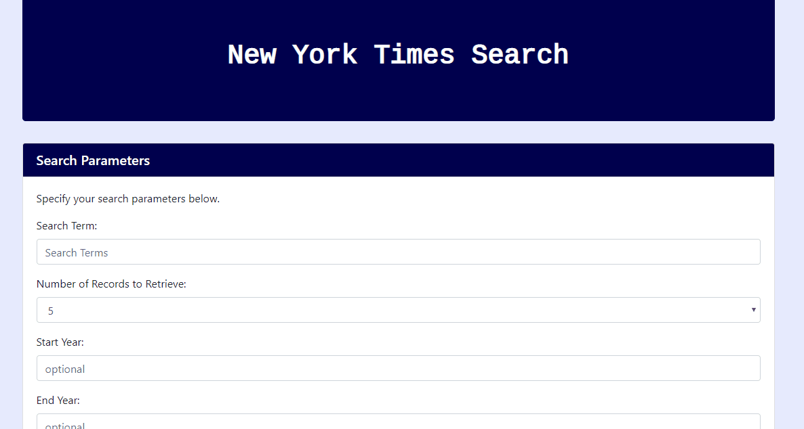

# NYT-Article-Search-Engine

This is a search engine for New York Times articles. It utilizes Javascript, jQuery, and AJAX calls to the New York Times API.

## Getting Started

To view and conduct your own testing, download from Github <https://github.com/digipet007/NYT-Article-Search-Engine> and open the index.html file in you web browser. This is all you need to get the project up and running on your local machine.

For a demo of the application, visit: <https://digipet007.github.io/NYT-Article-Search-Engine/>

### Prerequisites

This search engine works in most browsers for desktop computers, laptops, or mobile devices.

## Built With

* HTML
* CSS
* Javascript
* jQuery

This app utilizes:
* Bootstrap framework <https://getbootstrap.com/> 
* New York Times Database <https://developer.nytimes.com/>
* Parsley.js <http://parsleyjs.org/>
* Google Fonts <https://fonts.google.com>
* Moment.js <https://momentjs.com/>

## Contributing

Pull requests welcome!

## Author

* **Sarah Arnold** --view my portfolio and bio: <https://digipet007.github.io/Sarahs-Portfolio/>